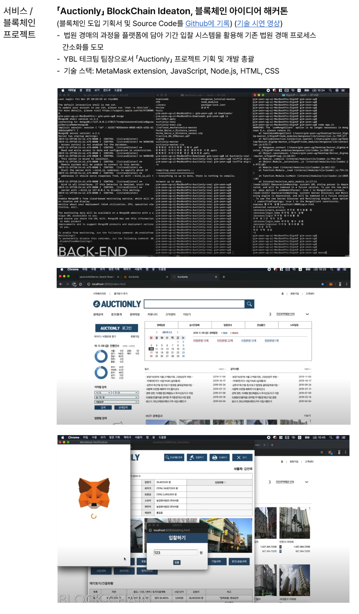

# BlockChain based Court Auction Bidding Process Service DApp ;Chung-Ang University(CAU) Idea Hackaton
:Prepare Hackathon:

## Summary




##  How to use

just **git clone** and import project

```latex
  *Requremnts*
  - A text editor (for example, VS Code)
  - npm 
  - Node.js
  - The MetaMask extension installed
  - Basic knowledge of JavaScript and React
```


## Tech Stack

- MetaMask Extension
- Node.js
- JavaScript
- React
- HTML
- CSS

## Tech Demo Video
[youtube link](https://youtu.be/TXx_buAF4sM)


## Role 

- 김연욱[PL] : DApp developer : [깃허브](https://github.com/yeonuk44)
- 외 YBL 개발 팀원: Web developer


## 기획팀 to do list

- [x] 사업계획서
- [x] Logo design
- [x] 영상 편집

## 사업계획서

### 1. Problem & Solution

블록체인 기반 법원 경매 플랫폼 Auctionly를 구상하게 된 동기는 중고차를 구매하기 위해 매물을 물색하던 과정에서 나왔다. 여러 구매처를 알아보던 중 중고차 딜러로 일하는 지인에게서 법원 경매 입찰 매물에 관해 이야기를 들었다. 사실 법원 경매하면 부동산 거래만 있는 줄 알았기 때문에 법원이 주체가 되어 중고차 경매를 진행한다는 사실은 의외였다. 법원 경매 관련 정보를 조사하며 왜 대중들에게 법원 경매에 대한 정보가 잘 전달되지 않는지 쉽게 알 수 있었다. 법원경매의 입찰 과정은 매우 복잡하고 제출할 관련 서류도 많기 때문이다. 그래서 일반인이 법원 경매에 참여하려면 대부분 중개인을 통하는 방법을 취한다. 하지만 이것은 또 다른 차원의 문제를 일으키는데 바로 중개 서비스가 취하는 과도한 수수료와 사기 문제, 그리고 중개인과 소비자 사이의 정보 비대칭 구조이다. 더하여 법원 경매 물품에 대한 감정 평가는 오로지 전문 감정평가사에게만 의존하고 있는데 이는 정보독점과 감정평가사와 중개인 사이의 밀약을 구조적으로 가능하게 한다.

상기하는 문제를 해결하기 위해 블록체인 기반 법원 경매 플랫폼 서비스인 Auctionly를 구상하게 되었다. 
#### 기대효과
1. 해시함수를 이용한 private key/public key를 사용해 개인의 신원을 안전하게 증명
2. 소비자에게 직관적인 UI/UX를 제공해 법원 경매 진입 장벽을 낮춰 일반인의 유입을 증가
3. 경매품 감정/유찰 결과에 외부 전문가들의 검증을 유도해 감정평가사와 중개인의 정보독점 및 밀약을 타파
4. 법원 경매 기간입찰 대리 서비스를 도입함으로 법원 경매 전반의 프로세스 간소화

즉, 해당 블록체인 기반의 서비스를 이용한다면 개인의 신원을 안전하게 공증받을 수 있고, 복잡한 절차를 보기 쉽게 정렬한 UI/UX를 통해 경매 참여의 접근성을 높일 수 있다. 또한, 경매품의 감정 결과와 경매 결과에 대해 자유롭게 이야기를 나눌 수 있는 커뮤니티를 도입해 사용자들이 자발적으로 양질의 정보를 제공하도록 돕니다. 이를 통해 일반인 입찰자들이 균형 있는 정보를 접할 수 있게 되어 감정평가사와 중개인에 대한 의존도가 낮아질 것을 기대한다. 마지막으로 일반인 경매 참여의 진입 장벽을 높이는 요인인 현장 경매 제도를 개선하기 위해 단기적으로 기간입찰 대리 서비스, 장기적으로 현장 경매 대리 서비스를 도입해 법원 경매 프로세스를 간소화한다.

### 2. 아이디어 개요 및 상세 설명


### 3. 고객 및 시장 분석


### 4. 실생활 활용성


### 5. 실제 이용 시나리오
